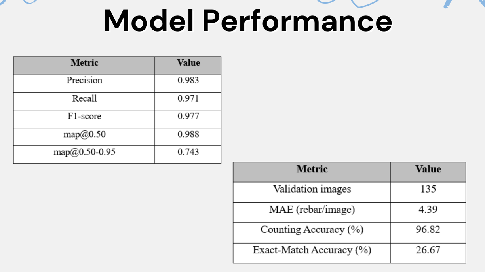

# Rebar Counting API

An AI-powered backend API for automated rebar counting using PyTorch and FastAPI. The backend is containerized with Docker and deployable through GitHub Actions and Render.com.

---

## 📌 Table of Contents

1. [Project Overview](#project-overview)  
2. [Model Performance](#model-performance)  
3. [Prerequisites](#prerequisites)  
4. [Running Locally](#running-locally)  
5. [Using Docker](#using-docker)  
6. [Deployment via GitHub Actions](#deployment-via-github-actions)  
7. [Environment Variables and Secrets](#environment-variables-and-secrets)  
8. [File Structure](#file-structure)

---

## 📖 Project Overview

This project serves a trained YOLOv8 PyTorch model through a FastAPI backend. It receives image uploads, processes them, and returns the rebar count. It’s intended to be consumed by a mobile app frontend.

The backend is containerized via Docker and supports CI/CD integration through GitHub Actions and Render.com.

---

## 📊 Model Performance



Detection metrics:

| Metric       | Value |
|--------------|-------|
| Precision    | 0.983 |
| Recall       | 0.971 |
| F1-score     | 0.977 |
| mAP@0.50     | 0.988 |
| mAP@0.50-0.95| 0.743 |

Counting metrics (on the validation set):

| Metric                  | Value |
|-------------------------|-------|
| Validation images       | 135   |
| MAE (rebar/image)       | 4.39  |
| Counting accuracy (%)   | 96.82 |
| Exact-match accuracy (%)| 26.67 |

---

## ⚙️ Prerequisites

- Python 3.10 (recommended for compatibility with Torch and FastAPI)
- [Poetry](https://python-poetry.org/) or `pip`
- Docker & Docker Desktop (for containerization)
- GitHub account
- Docker Hub account
- Render.com account (optional for deployment)

---

## ▶️ Running Locally (Without Docker)

1. **Clone the repository:**

```bash
git clone https://github.com/YOUR_USERNAME/rebar-api.git
cd rebar-api
```

2. **Create a virtual environment (Python 3.10):**

```bash
python3.10 -m venv venv
source venv/bin/activate  # On Windows: venv\Scripts\activate
```

3. **Install dependencies:**

```bash
pip install -r requirements.txt
```

4. **Ensure your trained YOLOv8 model (.pt) is in the root directory:**

Example: `rebar_yolov8s_100_epochs.pt`

5. **Run the FastAPI server:**

```bash
uvicorn app.server:app --reload
```

6. **Test locally:**

Visit:  
`http://localhost:8000/docs` to access the Swagger UI

---

## 🐳 Running with Docker

### 1. **Build the Docker image:**

```bash
docker build -t rebar-api:latest .
```

### 2. **Run the container:**

```bash
docker run -p 8000:8000 rebar-api:latest
```

This exposes your API at `http://localhost:8000`.

---

## 🚀 Deployment via GitHub Actions

CI/CD is automated via `.github/workflows/ci-cd-docker-render.yml`.

### ✔️ What it does:
- Builds the Docker image
- Pushes it to Docker Hub as `latest` and `${{ github.sha }}`
- Triggers deployment to Render using a deploy hook

### 🔐 Required GitHub Secrets:
Set these in your repository:
- `DOCKER_USERNAME`
- `DOCKER_PASSWORD`
- `RENDER_DEPLOY_HOOK`

### ⚠️ Trigger Conditions:
The workflow runs on every push to `main`, **excluding**:
- `README.md`, `.md` files, and `docs/` folder (see `paths-ignore`)

---

## 🛠️ Environment Variables and Configuration

None required for basic execution. Ensure the YOLOv8 model `.pt` file path is correctly specified in `yolov8_model.py`.

---

## 📁 File Structure

```text
rebar-api/
├── app/
│   ├── server.py             # FastAPI app
│   └── yolov8_model.py       # YOLOv8 model wrapper and inference logic
├── rebar_yolov8s_100_epochs.pt  # Trained YOLOv8 model weights
├── Dockerfile                # Docker build instructions
├── requirements.txt          # Python dependencies
├── .github/
│   └── workflows/
│       └── ci-cd-docker-render.yml  # GitHub Actions pipeline
├── README.md
```

---

## 🧪 Example Usage

Make a POST request to `/count/` with a PNG image:

```bash
curl -X POST http://localhost:8000/count/ -F "image=@your_rebar_image.png"
```

Expected response:

```json
{
  "rebarCount": 12
}
```

---

## 👥 Maintainers

- Mobile App Integration: Chew Chee Lel  
- AI Model Training: Chin Wei Han  
- Project Coordination: Tan Wei Ming  
- Quality Testing: Ong Chang Le

---

## ✅ Future Enhancements

- Add test suite for endpoints
- Add support for batch image upload and historical count analytics
- Optimize for lower-end devices and concurrent usage